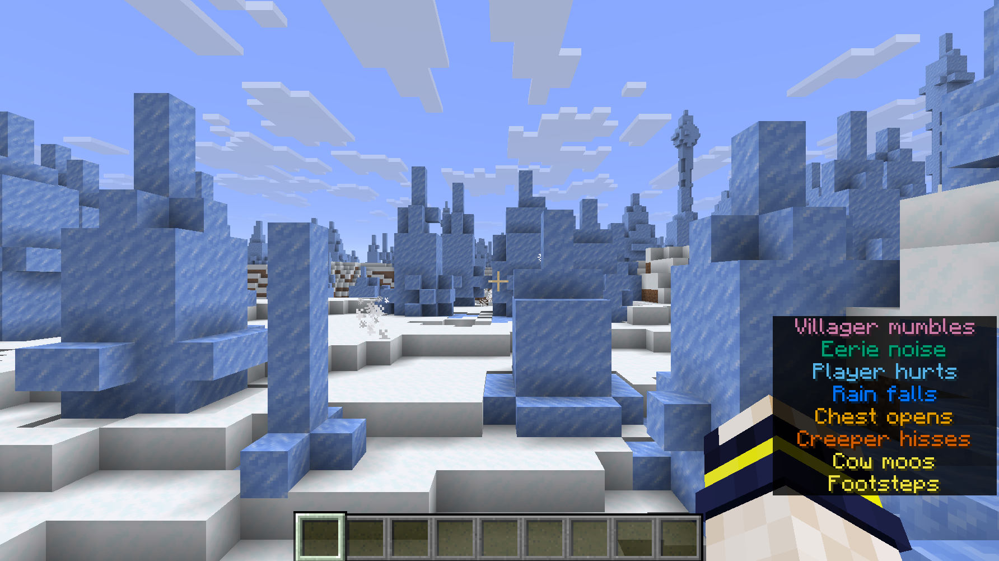
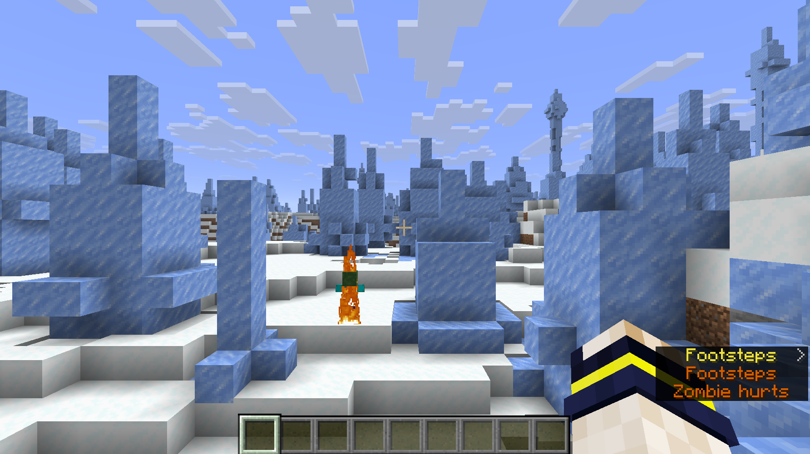
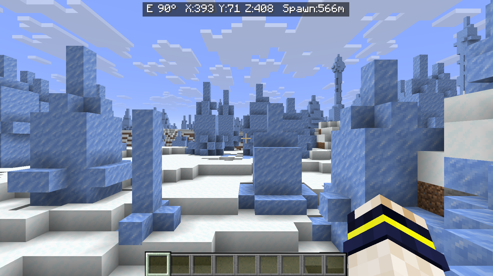
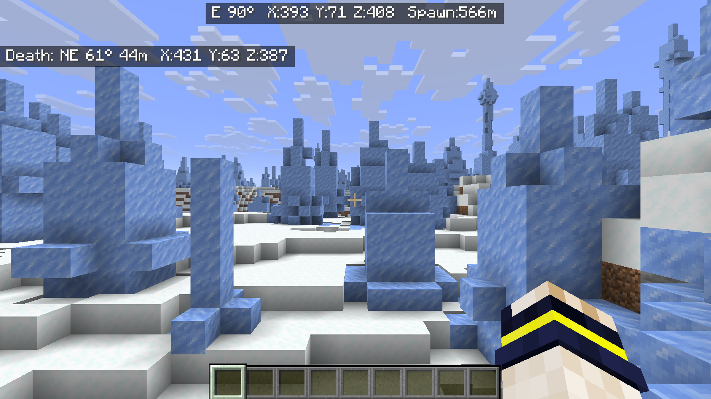
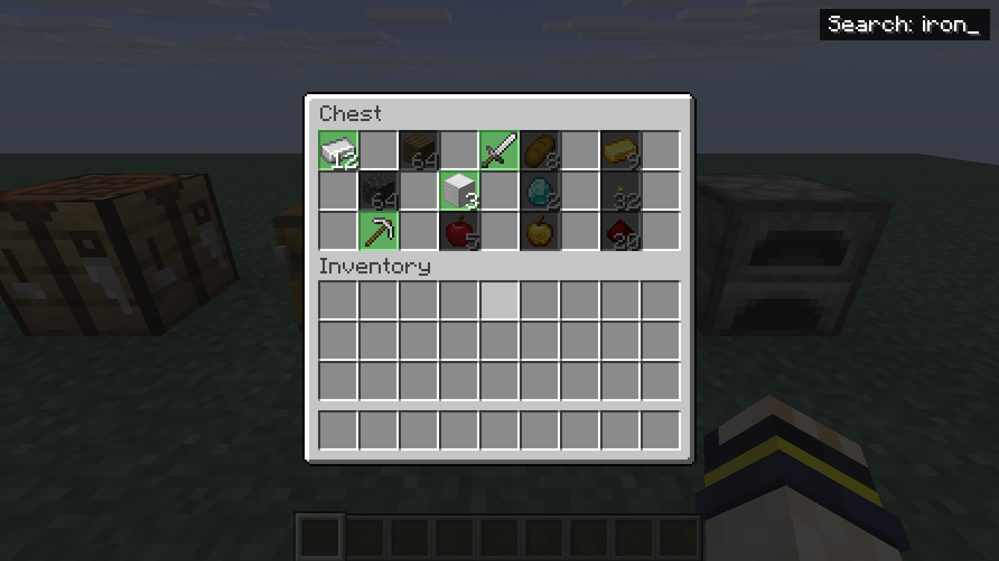
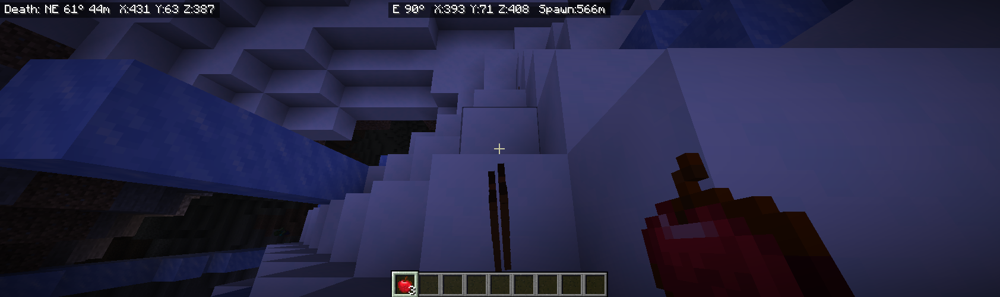

# Hullspark Fabric Mods

Small quality-of-life mods for Minecraft Java Edition (Fabric). One mod, one job.

| Mod | Version | What it does | Download |
|---|---|---|---|
| [Sound Subtitle Colors](mods/sound-subtitle-colors) | 0.1.1 | Colors the vanilla sound subtitles by category, with a colorblind-safe palette. | [CurseForge](https://www.curseforge.com/minecraft/mc-mods/sound-subtitle-colors) |
| [Hullspark Coordinate HUD](mods/coordinate-hud) | 0.1.2 | One line with direction, coordinates and horizontal distance to spawn. No minimap. | [CurseForge](https://www.curseforge.com/minecraft/mc-mods/hullspark-coordinate-hud) |
| [Death Point Marker](mods/death-point-marker) | 0.1.2 / 0.1.2+mc26.3 (Minecraft 26.3, source in `mods/death-point-marker/mc26.3/`) | After you die, shows bearing, distance and coordinates back to where you died. | [CurseForge](https://www.curseforge.com/minecraft/mc-mods/death-point-marker) |
| [Hullspark Chest Search](mods/chest-search) | 0.1.2 | Press Ctrl+F in any container to find items by name or id. | [CurseForge](https://www.curseforge.com/minecraft/mc-mods/hullspark-chest-search) |
| [Hullspark Item Pickup Filter](mods/item-pickup-filter) | 0.1.0 | Items on a blacklist (default: rotten flesh, poisonous potato, spider eye) are never auto-picked-up. Server-side; singleplayer works out of the box. | [CurseForge](https://www.curseforge.com/minecraft/mc-mods/hullspark-item-pickup-filter) |

All mods target **Minecraft 1.21.11** and need **Fabric Loader 0.19.5 or newer**. Where the table lists a second version, that mod also has a build for a newer Minecraft (same features, verified in-game on that version; Java 25 to build it). The first four are client-side and need **Fabric API**; Item Pickup Filter runs on the side that owns the world (singleplayer, or the dedicated server) and does not need Fabric API.
They do not collect or send any data.

## Screenshots

### Sound Subtitle Colors





### Hullspark Coordinate HUD



### Death Point Marker



### Hullspark Chest Search



### Hullspark Item Pickup Filter



## Install

1. Install Fabric Loader for Minecraft 1.21.11 and put Fabric API in your `mods` folder.
2. Download a mod from CurseForge, or take the zip from [`releases/`](releases) and unzip it.
3. Put the `.jar` file in your `mods` folder and start the game.

## Build from source

Each mod is its own Gradle project with a bundled wrapper. Java 21 is required.

```
cd mods/chest-search
./gradlew build
```

The jar is written to `build/libs/`.

## How these mods are made

These mods are developed with AI assistance (Claude) and reviewed by the author.
Every released version is checked in the running game before it is published.
No code or assets from other mods are reused.

## License

MIT. See [LICENSE](LICENSE).
